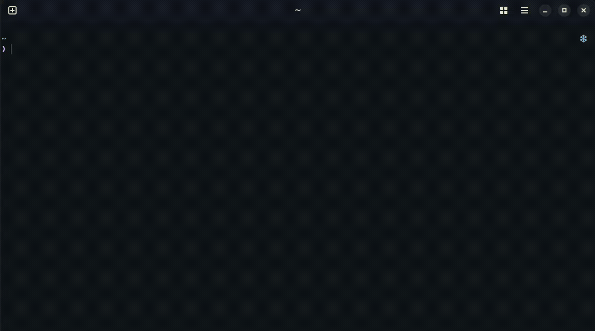
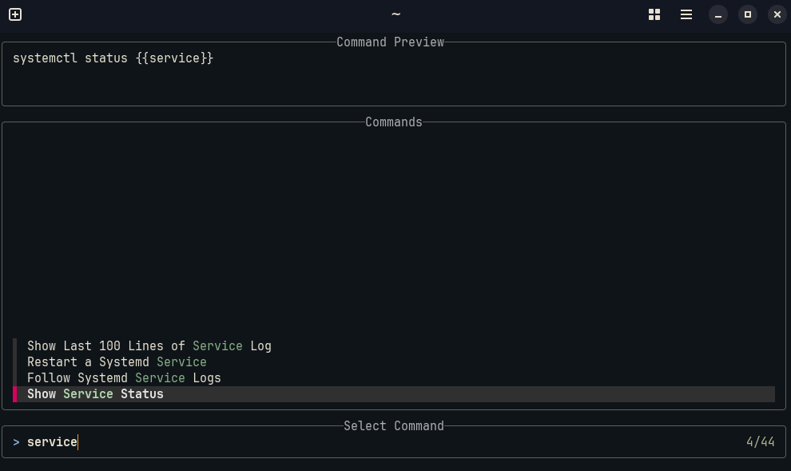
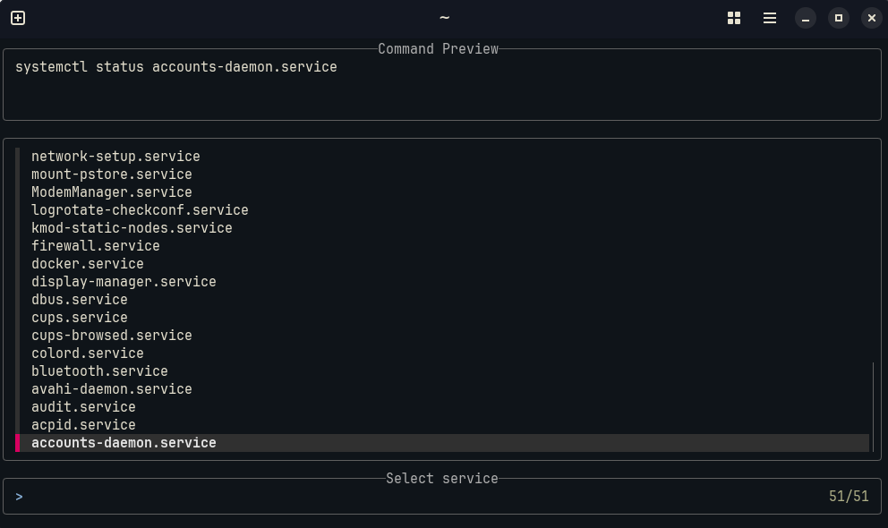

[](https://goreportcard.com/report/github.com/Tarow/cmdmark)
[](https://renovatebot.com)

# cmdmark

A small fzf-driven command-bookmark tool: store shell command templates in YAML, pick a template with fzf and fill variables interactively.

## Demo



## Example

```yaml
vars:
  containers:
    multi: true
    delimiter: " "
    options_cmd: docker ps --format '{{.Names}}'

  service:
    multi: false
    options_cmd: systemctl list-units --type=service --no-legend | awk '{print $1};

commands:
  - title: Follow Systemd Service Logs
    cmd: journalctl {{flags}} -u {{service}} -f
    vars:
      flags:
        required: false
        multi: true
        options:
          - --boot
          - --since "1 hour ago"

  - title: Stop Docker Containers
    cmd: docker stop {{containers}}

  - title: Find Files by Extensions
    cmd: find {{path}} -type f -name '*.{{ext}}'
    vars:
      ext:
        multi: false
        options:
          - py
          - go
          - js
```

## Install & Run

### Go

```bash
go install github.com/tarow/cmdmark@latest
cmdmark search --config config.yml
```

### Nix

```bash
nix run github:tarow/cmdmark -- search --config config.yml

```

## Shell Integration

When accepting a selection, `cmdmark` will print the command.
To put the selected command into the command line buffer, you can integrate cmdmark with your shell:

### Bash

```sh
function cmdmark-select() {
  BUFFER=$(cmdmark search --config ~/.config/cmdmark/config.yml)
  READLINE_LINE=$BUFFER
  READLINE_POINT=${#BUFFER}
}
bind -x '"\C-b": cmdmark-select'
```

### Zsh

```sh
function cmdmark-select() {
  BUFFER=$(cmdmark search --config ~/.config/cmdmark/config.yml)
  CURSOR=$#BUFFER
  zle redisplay
}
zle -N cmdmark-select
bindkey '^b' cmdmark-select
```

### Fish

```sh
function cmdmark-select
    commandline -r -- $(cmdmark search --config ~/.config/cmdmark/config.yml)
end
bind \cb cmdmark-select
```

## NixOS / Home Manager Module

To use the NixOS or Home Manager module, import the flake output `nixosModules.cmdmark` or `homeModules.cmdmark`.
You can then use the module like this:

```nix
programs.cmdmark = {
  enable = true;
  settings = {
    commands = [
      {
        title = "Find files by extension";
        cmd = "find {{path}} -type f -name '*.{{ext}}'";
        vars.ext.options = ["py" "nix" "js" " go"];
      }
    ];
  };
};
```

## Screenshots

### Command Selection



### Variable Selection


